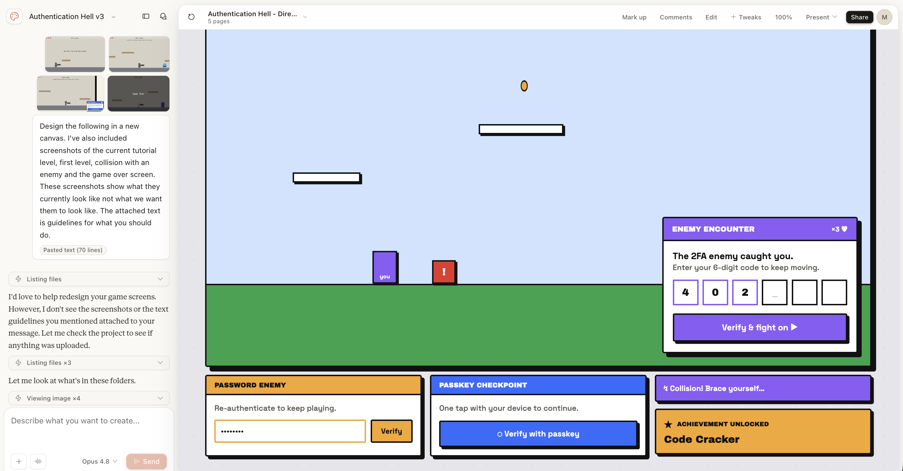

---
# No external theme — the look comes from ./style.css + ./layouts,
# mirroring the app's "HARD MODE" design system.
title: Welcome to Authentication Hell
info: |
  ## Welcome to Authentication Hell
  A browser-based game written in Ruby, and what it taught me about auth.

  Presented at Philly.rb.
drawings:
  persist: false
transition: slide-left
mdc: true
layout: cover
# Most slides are excluded from the Toc; flip this default to false per-slide
# to surface a slide (the section dividers do this).
defaults:
  hideInToc: true
---

# Authentication Hell

<div class="ah-tagline">A browser-based game built with Ruby · RubyConf · Mike Dalton</div>

<!--
Speaker notes go here, after the HTML comment marker.
Press `c` during the talk to open presenter mode.
The cover layout puts the title in an inked block with a hard offset shadow,
matching the app's brutalist headings.
-->

---
layout: section
hideInToc: false
---

## Agenda

<Toc minDepth="1" maxDepth="1" columns="2" class="ah-toc mt-6" />

<!--
The agenda is auto-generated from the `# Section` headings on the
`layout: section` divider slides below. The headmatter sets
`defaults: { hideInToc: true }`, so slides are excluded unless they
override it with `hideInToc: false` — only those dividers do, so only
they appear here. Reorder or rename a section and this list follows
automatically. Entries are clickable and the current section
highlights while presenting.
-->

---
layout: section
hideInToc: false
---

# What is authentication hell?

<!-- What do I mean by authentication hell... -->

---
layout: image
image: /images/create-password-rules.png
backgroundSize: cover
---

---
layout: image
image: /images/okta-verify-push.png
backgroundSize: cover
---

---
layout: image
image: /images/authy-totp-codes.png
backgroundSize: cover
---

---
layout: image
image: /images/email-otp-code.png
backgroundSize: cover
---

---
layout: image
image: /images/security-key-webauthn.png
backgroundSize: cover
---

---
layout: section
hideInToc: false
---

# DragonRuby

---
layout: two-cols
layoutClass: gap-8
---

## DragonRuby Game Toolkit

- Cross-platform 2D game engine
  - Desktop
  - Console
  - Steam Deck
  - Mobile
  - Web
- Write games in Ruby!

::right::

<div class="flex items-center justify-center h-full">
  
</div>

---
layout: two-cols
layoutClass: gap-8
---

## DragonRuby is Ruby

- Custom Ruby runtime
- Based on [mruby](https://mruby.org/)
- Subset of Ruby language specification
- No Gem support

::right::

<div class="flex items-center justify-center h-full">
  
</div>

---
layout: two-cols
layoutClass: gap-8
---

## Simple DirectMedia Layer (SDL)

- DragonRuby wraps SDL
- Provides low-level access to graphics, audio, and input
- Supports all platforms

::right::

<div class="flex items-center justify-center h-full">
  
</div>

<!--
DragonRuby sits on top of SDL — it's what gives us hardware-accelerated
graphics, audio, and input across every platform, including the WASM build.
-->

---
---

## tick method

- Runs 60 times per second (60 frames per second)

---
layout: two-cols
layoutClass: gap-8
---

## Movement

````md magic-move
```ruby
def tick(args)
  args.state.player ||= {
    x: 100, y: 100,
    w: 50, h: 50,
    path: 'sprites/square/green.png'
  }
end
```
```ruby
def tick(args)
  args.state.player ||= {
    x: 100, y: 100,
    w: 50, h: 50,
    path: 'sprites/square/green.png'
  }

  args.outputs.sprites << args.state.player
end
```
```ruby
def tick(args)
  args.state.player ||= {
    x: 100, y: 100,
    w: 50, h: 50,
    path: 'sprites/square/green.png'
  }

  if args.inputs.up
    args.state.player.y += 10
  elsif args.inputs.down
    args.state.player.y -= 10
  end

  if args.inputs.left
    args.state.player.x -= 10
  elsif args.inputs.right
    args.state.player.x += 10
  end

  args.outputs.sprites << args.state.player
end
```
````

::right::

<div class="flex items-center justify-center h-full">
  <div class="relative w-full aspect-video">
    
    
    <SlidevVideo v-after autoplay loop muted class="absolute inset-0 w-full h-full object-contain">
      <source :src="'/videos/sprite-moving.mp4'" type="video/mp4" />
    </SlidevVideo>
  </div>
</div>

---
layout: two-cols
layoutClass: gap-8
---

## Collisions

````md magic-move
```ruby
def tick(args)
  args.state.terrain ||= [...]
  args.outputs.sprites << args.state.terrain

  args.state.player ||= {...}
  args.outputs.sprites << args.state.player
end
```
```ruby
def tick(args)
  args.state.terrain ||= [...]
  args.outputs.sprites << args.state.terrain

  args.state.player ||= {...}
  args.outputs.sprites << args.state.player

  args.state.player.dx = args.inputs.left_right * 2
  args.state.player.x += args.state.player.dx
end
```
```ruby
def tick(args)
  args.state.terrain ||= [...]
  args.outputs.sprites << args.state.terrain

  args.state.player ||= {...}
  args.outputs.sprites << args.state.player

  args.state.player.dx = args.inputs.left_right * 2
  args.state.player.x += args.state.player.dx

  collision = args.state.terrain.find do |t|
    t.intersect_rect?(args.state.player)
  end
  
  if collision
    args.state.player.x -= args.state.player.dx
  end
end
```
````

::right::

<div class="flex items-center justify-center h-full">
  <div class="relative w-full aspect-video">
    
    <SlidevVideo v-click="[1, 2]" autoplay loop muted class="absolute inset-0 w-full h-full object-contain">
      <source :src="'/videos/collision.mp4'" type="video/mp4" />
    </SlidevVideo>
    <SlidevVideo v-after autoplay loop muted class="absolute inset-0 w-full h-full object-contain">
      <source :src="'/videos/collision-resolved.mp4'" type="video/mp4" />
    </SlidevVideo>
  </div>
</div>

---
layout: section
hideInToc: false
---

# Authentication Hell: The Game

---
---

## Tech Stack

- DragonRuby game compiled to WASM
- Embedded inside a Rails 8 app
- Built-in Rails Authentication generator
- rotp and webauthn gems

---
---

## Game Demo

<div class="absolute inset-0 flex items-center justify-center">
  <a
    href="http://localhost:3000/game"
    target="_blank"
    rel="noopener"
    class="ah-card bg-white px-6 py-4 text-xl font-bold no-underline !text-ink"
  >
    ▶ Demo ↗
  </a>
</div>

---
---

## Proof of concept

<div class="flex justify-center mt-6">
  <div class="ah-card bg-white p-2 leading-none">
    <SlidevVideo autoplay loop muted class="block max-h-[42vh] w-auto">
      <source :src="'/videos/proof-of-concept.mp4'" type="video/mp4" />
    </SlidevVideo>
  </div>
</div>

---
---

## Discord to the rescue

<div class="flex flex-col items-center gap-3 mt-3">
  <div class="ah-card bg-white p-2 leading-none">
    
  </div>
  <div class="ah-card bg-white p-2 leading-none">
    
  </div>
</div>

---
---

## Game Theme

- Player stuck in a training video
- Each level is a playlist
- Enemies are authentication

---
---

## Claude Design

<div class="flex justify-center mt-6">
  <div class="ah-card bg-white p-2 leading-none">
    
  </div>
</div>

---
---

## Authenticate in game

<div class="flex justify-center mt-6">
  <div class="ah-card bg-white p-2 leading-none">
    <SlidevVideo autoplay loop muted class="block max-h-[42vh] w-auto">
      <source :src="'/videos/authenticate-in-game.mp4'" type="video/mp4" />
    </SlidevVideo>
  </div>
</div>

---
---

## Trigger authentication (game)

````md magic-move
```ruby
def tick(args)
  args.state.collision_request = DR.http_post(
    "http://localhost:3000/games/password/start"
  )
end
```
```ruby
def tick(args)
  if args.state.collision_request && args.state.collision_request[:complete]
    args.state.collision_request = nil
    args.state.player.frozen = true
  end
  
  args.state.collision_request = DR.http_post(
    "http://localhost:3000/games/password/start"
  )
end
```
```ruby
def tick(args)
  if args.state.collision_request && args.state.collision_request[:complete]
    args.state.collision_request = nil
    args.state.player.frozen = true
  end
  
  args.state.collision_request = DR.http_post(
    "http://localhost:3000/games/password/start"
  )
  
  if args.state.player.frozen
    if !args.state.status_request
      args.state.status_request = DR.http_get("http://localhost:3000/games/password/status")
    end
  end
end
```
```ruby
def tick(args)
  if args.state.collision_request && args.state.collision_request[:complete]
    args.state.collision_request = nil
    args.state.player.frozen = true
  end
  
  args.state.collision_request = DR.http_post(
    "http://localhost:3000/games/password/start"
  )
  
  if args.state.player.frozen
    if !args.state.status_request
      args.state.status_request = DR.http_get("http://localhost:3000/games/password/status")
    elsif args.state.status_request[:complete]
      data = DR.parse_json(args.state.status_request[:response_data])
      if data && data["frozen"] == false
        args.state.player.frozen = false
      end
      args.state.status_request = nil
    end
  end
end
```
````

---
---

## Trigger authentication (web)

````md magic-move
```ruby
class Games::PasswordChallengeController < ApplicationController
  skip_forgery_protection only: :start

  def start
    Current.session.game_challenges.find_or_create_by!(kind: "password")
    Turbo::StreamsChannel.broadcast_append_to(
      Current.user, :toasts,
      target: "toasts",
      partial: "games/password_challenge",
      locals: { user: Current.user }
    )
    head :no_content
  end
end
```
```ruby
class Games::PasswordChallengeController < ApplicationController
  skip_forgery_protection only: :start

  def start
    Current.session.game_challenges.find_or_create_by!(kind: "password")
    Turbo::StreamsChannel.broadcast_append_to(
      Current.user, :toasts,
      target: "toasts",
      partial: "games/password_challenge",
      locals: { user: Current.user }
    )
    head :no_content
  end
  
  def status
    render json: { locked: Current.session.game_challenges.exists?(kind: "password") }
  end
end
```
````

---
---

## Resolve authentication (web)

````md magic-move
```ruby
class Games::PasswordChallengeController < ApplicationController
  def complete
    if Current.session.game_challenges.exists?(kind: "password") && Current.user.authenticate(params[:password])
      Current.session.game_challenges.where(kind: "password").delete_all
      render turbo_stream: turbo_stream.remove("toast")
    else
      render turbo_stream: turbo_stream.replace(
        "toast",
        partial: "games/password_challenge",
        locals: { user: Current.user, error: "Invalid password. Try again." }
      )
    end
  end
end
```
````

---
layout: cover
---

# Questions or feedback?

<div class="flex items-start justify-center gap-16 mt-10">
  <div class="flex flex-col items-center">
    <a href="https://authenticationhell.com" target="_blank" rel="noopener" class="ah-tagline !mt-0 mb-3 text-xl !text-ink no-underline">authenticationhell.com</a>
    <div class="ah-card bg-white p-4 leading-none">
      
    </div>
  </div>
  <div class="flex flex-col items-center">
    <a href="https://github.com/kcdragon/authentication-hell" target="_blank" rel="noopener" class="ah-tagline !mt-0 mb-3 text-xl !text-ink no-underline flex items-center gap-2">
      <ph-github-logo-fill class="text-2xl" /> kcdragon/authentication-hell
    </a>
    <div class="ah-card bg-white p-4 leading-none">
      
    </div>
  </div>
</div>

<div class="absolute bottom-4 left-0 right-0 text-center text-xs text-muted">
  Built with
  <a href="https://www.ruby-lang.org/en/" target="_blank" rel="noopener">Ruby</a>
  ·
  <a href="https://rubyonrails.org/" target="_blank" rel="noopener">Ruby on Rails</a>
  ·
  <a href="https://dragonruby.org/" target="_blank" rel="noopener">DragonRuby</a>
  ·
  <a href="https://sli.dev/" target="_blank" rel="noopener">Slidev</a>
</div>
