# Authentication Hell

<div class="ah-tagline">A browser-based game built with Ruby · RubyConf · Mike Dalton</div>

<div class="mt-10 flex justify-end pr-8">
  <div class="ah-card bg-white p-2 leading-none -rotate-2">
    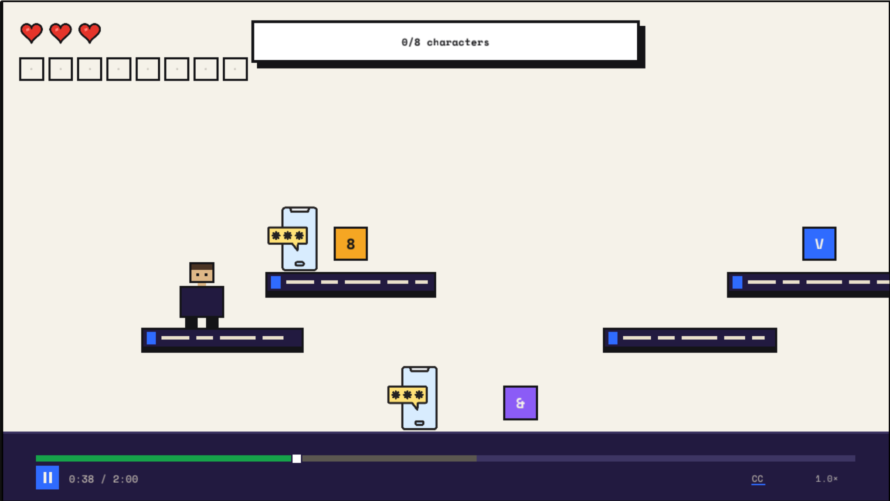
  </div>
</div>

<div v-drag="[191,254,180,220]" class="flex flex-col items-center">
  <a href="https://authenticationhell.com" target="_blank" rel="noopener" class="ah-tagline !mt-0 mb-3 text-lg !text-ink no-underline">authenticationhell.com</a>
  <div class="ah-card bg-white p-3 leading-none rotate-2">
    
  </div>
</div>


<!--
Hi everyone. Thanks for coming to my talk Authentication Hell, a browser-based game built with Ruby.
-->

---

## Play along!

<div class="flex items-center justify-center gap-16 mt-10">
  <div class="max-w-md space-y-4 text-2xl">
    <p>Feel free to <strong>play the game during the talk.</strong></p>
    <p>Sign up, then dive into Authentication Hell on your laptop.</p>
  </div>
  <div class="flex flex-col items-center">
    <a href="https://authenticationhell.com" target="_blank" rel="noopener" class="ah-tagline !mt-0 mb-3 text-xl !text-ink no-underline">authenticationhell.com</a>
    <div class="ah-card bg-white p-4 leading-none">
      
    </div>
  </div>
</div>

<!--
I know some of you will be tempted to play the game during my talk so I want to let you know that's all right! You can check the game out at authenticationhell.com
-->

---
layout: fact
---

<div class="flex items-center justify-center gap-5">
  <div class="relative h-64 w-64">
    
    
  </div>
  <h1 class="!m-0 !text-5xl">Hi, I'm Mike</h1>
</div>

<style>
img.mustache-slide.slidev-vclick-target {
  transition: transform 1.8s cubic-bezier(0.22, 1, 0.36, 1), opacity 0.6s ease;
}
img.mustache-slide.slidev-vclick-hidden {
  transform: translate(calc(-50% - 380px), 0);
}
</style>

<!--
Hi! I'm Mike. You may know me as this floating head from social media. I've had a couple people mention it doesn't quite look like me anymore so I've updated it to include a mustache.
-->

---
layout: fact
---

<div class="flex items-center justify-center gap-5">
  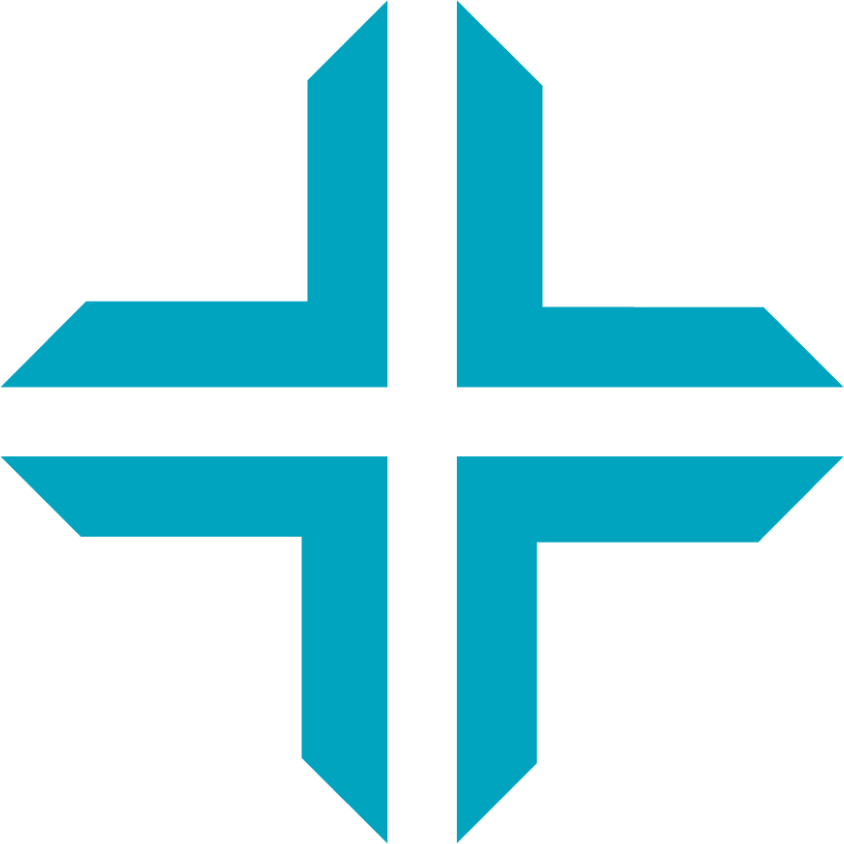
  <h1 class="!m-0 !text-5xl">Engineer at Triumph</h1>
</div>

<!--
I'm a staff engineer at a company called Triumph.
-->

---
layout: fact
---

<div class="flex items-center justify-center gap-5">
  <h1 class="!m-0 !text-5xl">Love to build side projects</h1>
</div>

<div v-drag="[218,37,133,162]" class="flex flex-col items-center">
  
  <div class="mt-2 text-center font-bold">Calendar Vision</div>
</div>


<div v-drag="[673,40,129,162]" class="flex flex-col items-center">
  
  <div class="mt-2 text-center font-bold">Broadside</div>
</div>

<!--
And in my spare time I love to work on side projects including this one.
-->

---
layout: section
hideInToc: false
---

# "Authentication Hell"

---
layout: fact
---

## I like my job

<!--
I like my job
-->

---
layout: fact
---

## But there's one thing...

<!--
But there's one thing that drive's my crazy
-->

---
layout: center
---

<div class="absolute inset-0 overflow-hidden pointer-events-none">
  
  
  
  
  
  
  
  
</div>


<style>
img.okta-push.slidev-vclick-target {
  position: absolute;
  width: 300px;
  height: auto;
  border-radius: 14px;
  box-shadow: 0 10px 30px rgba(0, 0, 0, 0.25);
  transition: transform 0.9s cubic-bezier(0.22, 1, 0.36, 1), opacity 0.5s ease;
}
img.okta-push.push-from-t  { transform: translate(0, 0) rotate(-3deg); transition-delay: 0ms; }
img.okta-push.push-from-tr { transform: translate(0, 0) rotate(4deg);  transition-delay: 500ms; }
img.okta-push.push-from-r  { transform: translate(0, 0) rotate(-2deg); transition-delay: 900ms; }
img.okta-push.push-from-br { transform: translate(0, 0) rotate(3deg);  transition-delay: 1050ms; }
img.okta-push.push-from-b  { transform: translate(0, 0) rotate(-4deg); transition-delay: 1200ms; }
img.okta-push.push-from-bl { transform: translate(0, 0) rotate(2deg);  transition-delay: 1350ms; }
img.okta-push.push-from-l  { transform: translate(0, 0) rotate(5deg);  transition-delay: 1500ms; }
img.okta-push.push-from-tl { transform: translate(0, 0) rotate(-5deg); transition-delay: 1650ms; }

img.okta-push.push-from-t.slidev-vclick-hidden  { transform: translate(0, -120vh) rotate(-3deg); }
img.okta-push.push-from-b.slidev-vclick-hidden  { transform: translate(0, 120vh)  rotate(-4deg); }
img.okta-push.push-from-l.slidev-vclick-hidden  { transform: translate(-140vw, 0) rotate(5deg); }
img.okta-push.push-from-r.slidev-vclick-hidden  { transform: translate(140vw, 0)  rotate(-2deg); }
img.okta-push.push-from-tl.slidev-vclick-hidden { transform: translate(-140vw, -120vh) rotate(-5deg); }
img.okta-push.push-from-tr.slidev-vclick-hidden { transform: translate(140vw, -120vh)  rotate(4deg); }
img.okta-push.push-from-bl.slidev-vclick-hidden { transform: translate(-140vw, 120vh)  rotate(2deg); }
img.okta-push.push-from-br.slidev-vclick-hidden { transform: translate(140vw, 120vh)   rotate(3deg); }
</style>

<!--
And that's Okta. Specifically...

Okta push notifications
-->

---
layout: image
image: /images/kitchen-happy.png
backgroundSize: cover
---

<!--
My work day starts like this
-->

---
layout: image
image: /images/hell-login-password.png
backgroundSize: cover
---

<!--
Sign into my computer with my password
-->

---
layout: image
image: /images/hell-okta-push.png
backgroundSize: cover
---

<!--
Then answer an Okta push notification
-->

---
layout: image
image: /images/hell-vpn-password.png
backgroundSize: cover
---

<!--
Once I connect to the internet, I need to connect to the VPN
-->

---
layout: image
image: /images/hell-okta-push.png
backgroundSize: cover
---

<!--
The answer an Okta push notification
-->

---
layout: image
image: /images/hell-aws-vault.png
backgroundSize: cover
---

<!--
We access Claude through AWS Bedrock which requires signing into AWS Vault
-->

---
layout: image
image: /images/hell-okta-github.png
backgroundSize: cover
---

<!--
We access Github through Okta...
-->

---
layout: image
image: /images/hell-okta-push.png
backgroundSize: cover
---

<!--
Which requires another Okta push notification
-->

---
layout: image
image: /images/hell-okta-teleport.png
backgroundSize: cover
---

<!--
And if I want to deploy, I need to sign in through Teleport
-->

---
layout: image
image: /images/hell-okta-push.png
backgroundSize: cover
---

<!--
Which requires another Okta push notification
-->

---
layout: image
image: /images/kitchen-defeated.png
backgroundSize: cover
---

<!--
And when I'm done all that I start to look like this
-->

---
layout: fact
---

## Welcome to Authentication Hell

<!--
Welcome to Authentication Hell
-->

---

<div class="grid grid-cols-3 gap-x-5 gap-y-4 h-full content-center w-fit mx-auto">
  <div class="ah-card bg-white p-2 leading-none">
    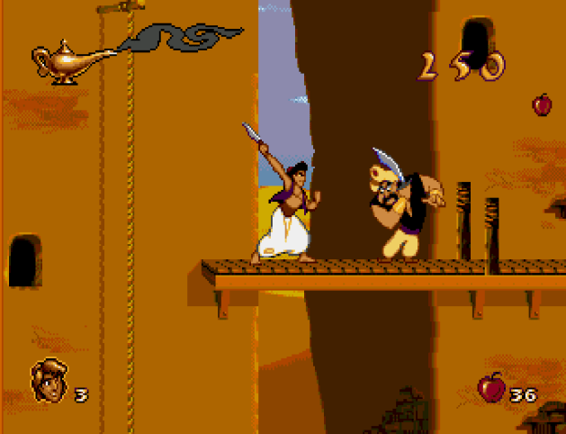
    <div class="mt-1 text-center text-sm font-bold">Aladdin</div>
  </div>
  <div class="ah-card bg-white p-2 leading-none">
    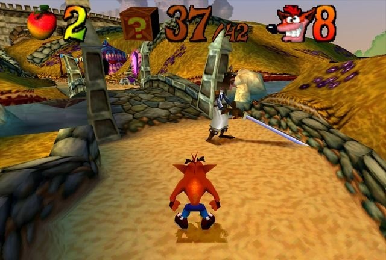
    <div class="mt-1 text-center text-sm font-bold">Crash Bandicoot: Warped</div>
  </div>
  <div class="ah-card bg-white p-2 leading-none">
    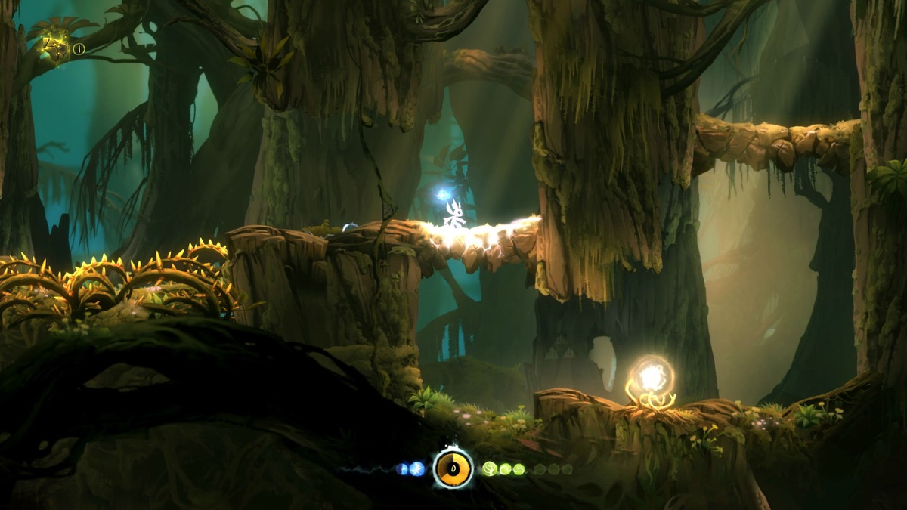
    <div class="mt-1 text-center text-sm font-bold">Ori and the Blind Forest</div>
  </div>
  <div class="ah-card bg-white p-2 leading-none">
    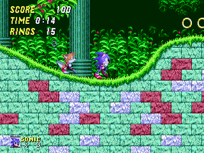
    <div class="mt-1 text-center text-sm font-bold">Sonic the Hedgehog 2</div>
  </div>
  <div class="ah-card bg-white p-2 leading-none">
    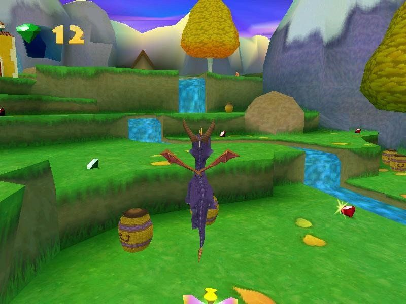
    <div class="mt-1 text-center text-sm font-bold">Spyro the Dragon</div>
  </div>
  <div class="ah-card bg-white p-2 leading-none">
    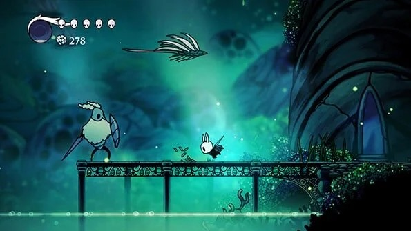
    <div class="mt-1 text-center text-sm font-bold">Hollow Knight</div>
  </div>
</div>

<!--
I've been a gamer my whole life. From Sega to PlayStation to PC. Raise your hand if you've played one of these games in your life.
-->

---
layout: section
hideInToc: false
---

# What if there was a game?

<!--
And I kept having this thought... What if there was a game that poked fun of the absurdity of authentication? A game where the penalty was having to re-authentication.
-->

---
layout: image
image: /images/rubyconf-cfp.png
backgroundSize: cover
---

<!--
Earlier this year, they announced the CFP for RubyConf. They were looking for talk in several different tracks.
-->

---
hideInToc: true
---

## "Weird Ruby" Track

<blockquote class="mt-8 border-l-4 border-ink pl-6 italic" style="font-size: 3rem; line-height: 1.3;">
  ...A program which absolutely should not exist, yet, defying all reason and good taste, does....And we want you to do it in Ruby.
</blockquote>

<!--
One of those track was "Weird Ruby". They were looking for talks about "A program which absolutely should not exist, yet, defying all reason and good taste, does... And we want you to do it in Ruby. And that sounds like the perfect fit for this game.
-->

---
layout: section
hideInToc: false
---

# Authentication Hell: The Game

<!--
Introducing Authentication Hell: The Game
-->

---

<div class="absolute inset-0 overflow-hidden bg-black">
  <iframe
    src="http://localhost:3000/auto_sign_in?return_to=/game"
    title="Authentication Hell — live demo"
    allow="cross-origin-isolated; autoplay; fullscreen; gamepad"
    class="border-0 origin-top-left"
    style="width: 1440px; height: 810px; transform: scale(0.68056);"
  ></iframe>
</div>

<!--
Let's try to do a live demo

...Demo first two levels...

I don't want to give anything more away in the game. You can check it out later.
-->

---

<div class="absolute inset-0 flex items-center justify-center p-6">
  <div class="ah-card bg-white p-2 leading-none">
    <SlidevVideo autoplay loop muted class="block max-h-[92vh] max-w-full w-auto">
      <source :src="'/videos/password-complexity-with-game-over.mp4'" type="video/mp4" />
    </SlidevVideo>
  </div>
</div>

<!--
This was the backup demo slide in case the demo didn't work.
-->

---

## Security training course

<Framed src="/images/course-landing-page.png" alt="AuthHell course landing page styled as corporate security training: an Authentication Hell course card with a Start the course button, an Onboarding Tape Lesson 1 video player, and a What You'll Learn checklist" />

<div v-drag="[16,165,191,56,-7]" data-id="start-the-course-label" class="ah-card bg-white px-3 py-1.5 font-bold -rotate-2 grid place-items-center">"Start the course"</div>
<FancyArrow color="red-500" width="3" from="[data-id=start-the-course-label]@bottom" to="(300, 350)" />

<div v-drag="[777,229,192,59,16]" data-id="what-youll-learn-label" class="ah-card bg-white px-3 py-1.5 font-bold -rotate-2 grid place-items-center">"What you'll learn"</div>
<FancyArrow color="red-500" width="3" from="[data-id=what-youll-learn-label]@bottom" to="(550, 420)" />

<!--
The theme of the game is a security training course. You play a new hire who has to take security training. If you've ever worked at a big company, you know exactly what those are like.
-->

---

## Each level is a video

<Framed>
  <div class="flex items-center justify-center gap-6">
    <div class="ah-card bg-white p-2 leading-none">
      
    </div>
    <div class="ah-card bg-white p-2 leading-none">
      
    </div>
  </div>
</Framed>

<div v-drag="[22,229,150,44,-14]" data-id="play-label" class="ah-card bg-white px-3 py-1.5 font-bold -rotate-2 grid place-items-center">Play / pause</div>
<FancyArrow color="red-500" width="3" from="[data-id=play-label]@bottom" to="(100, 435)" />

<div v-drag="[267,475,90,44,-9]" data-id="timer-label" class="ah-card bg-white px-3 py-1.5 font-bold rotate-2 grid place-items-center">Timer</div>
<FancyArrow color="red-500" width="3" from="[data-id=timer-label]@top" to="(200, 430)" />

<div v-drag="[733,38,150,44,11]" data-id="playlist-label" class="ah-card bg-white px-3 py-1.5 font-bold rotate-2 grid place-items-center">Level select</div>
<FancyArrow color="red-500" width="3" from="[data-id=playlist-label]@bottom" to="(750, 210)" />

<!--
Each level in the game is a video.
You can see all the levels in the playlist on the right.
There's a button to pause the "video".
There's a timer to keep track of the time remaining.
But don't let the time go to 0 before you collect your certificate!
-->

---

## Enemies are authentication

<Framed src="./images/enemies-authentication.png" alt="Game scene with three enemies on platforms — a password phone, a passkey cloud key, and a locked password field — each representing an authentication challenge" />

<div v-drag="[120,300,140,44,-8]" data-id="enemy-2fa-label" class="ah-card bg-white px-3 py-1.5 font-bold -rotate-2 grid place-items-center">2FA code</div>
<FancyArrow color="red-500" width="3" from="[data-id=enemy-2fa-label]@right" to="(430, 335)" />

<div v-drag="[420,150,110,44,6]" data-id="enemy-passkey-label" class="ah-card bg-white px-3 py-1.5 font-bold rotate-2 grid place-items-center">Passkey</div>
<FancyArrow color="red-500" width="3" from="[data-id=enemy-passkey-label]@bottom" to="(510, 245)" />

<div v-drag="[720,300,130,44,8]" data-id="enemy-password-label" class="ah-card bg-white px-3 py-1.5 font-bold rotate-2 grid place-items-center">Password</div>
<FancyArrow color="red-500" width="3" from="[data-id=enemy-password-label]@left" to="(615, 335)" />

<div class="absolute inset-0 overflow-hidden pointer-events-none">
  
  
  
</div>

<style>
img.auth-toast.slidev-vclick-target {
  position: absolute;
  width: 310px;
  height: auto;
  transition: transform 0.9s cubic-bezier(0.22, 1, 0.36, 1), opacity 0.5s ease;
}
img.auth-toast.toast-from-l { transform: translate(0, 0) rotate(-2deg); transition-delay: 0ms; }
img.auth-toast.toast-from-t { transform: translate(0, 0) rotate(2deg);  transition-delay: 250ms; }
img.auth-toast.toast-from-r { transform: translate(0, 0) rotate(-3deg); transition-delay: 500ms; }

img.auth-toast.toast-from-l.slidev-vclick-hidden { transform: translate(-140vw, 0) rotate(-2deg); }
img.auth-toast.toast-from-t.slidev-vclick-hidden { transform: translate(0, 120vh)  rotate(2deg); }
img.auth-toast.toast-from-r.slidev-vclick-hidden { transform: translate(140vw, 0)  rotate(-3deg); }
</style>

<!--
Enemies in the game are authentication methods.

If you get hit by an enemy, you'll have to either re-authenticate with your password, one time password or passkey depending on the enemy that hits you.
-->

---

## Earn a certificate

<Framed src="./images/certificate.png" imgClass="block max-h-[400px] w-auto" alt="Course complete page: 'You beat Authentication Hell' above a Certificate of Completion awarded to kcdragon, with a QR code, Download PDF and Back to the game buttons, and share links" />

<div v-drag="[19,169,237,44,-6]" data-id="proof-label" class="ah-card bg-white px-3 py-1.5 font-bold -rotate-2 grid place-items-center">Prove you passed</div>
<FancyArrow color="red-500" width="3" from="[data-id=proof-label]@right" to="(411, 240)" />

<div v-drag="[743,383,180,44,7]" data-id="share-label" class="ah-card bg-white px-3 py-1.5 font-bold rotate-2 grid place-items-center">Share to social</div>
<FancyArrow color="red-500" width="3" from="[data-id=share-label]@left" to="(499, 500)" />

<!--
If you beat the game, you'll be presented with your very on certificate proving to the world your authentication competency.
Share your certificate with the world with the convenient social links.
-->

---
layout: section
hideInToc: false
---

# Introduction to DragonRuby

---
layout: image-right
image: /images/dragonruby-logo.png
backgroundSize: contain
---

## DragonRuby Game Toolkit

- Cross-platform 2D game engine
  - Desktop
  - Console
  - Steam Deck
  - Mobile
  - Web
- Write games in Ruby!

---
layout: image-right
image: /images/mruby-logo.png
backgroundSize: contain
---

## DragonRuby is Ruby

- Custom Ruby runtime
- Based on [mruby](https://mruby.org/)
- Smaller memory footprint
- Subset of Ruby language specification
  - Missing some standard library like `fileutils`, `json` and `net/http` 
  - No Gem support
  - Restricted reflection (i.e. no `defined?`)
  - Other limitations

---
layout: image-right
image: /images/sdl-logo.png
backgroundSize: contain
---

## Simple DirectMedia Layer

- DragonRuby wraps SDL
- Provides low-level access to graphics, audio, and input
- Supports all platforms

<!--
DragonRuby sits on top of SDL — it's what gives us hardware-accelerated
graphics, audio, and input across every platform, including the WASM build.
-->

---
layout: two-cols-header
---

## tick

::left::

<FileName>main.rb</FileName>

```ruby
def tick(args)
end
```

::right::

- The entry point for your game's code
- `args` gives you everything you need:
  - `args.inputs` - read keyboard, mouse, and controller input
  - `args.outputs` - draw sprites and labels
  - `args.state` - store game state across ticks
- Called **60 times per second** - that's 60 FPS

---
layout: two-cols-header
---

## tick

::left::

<FileName>main.rb</FileName>

````md magic-move
```ruby
def tick(args)
end
```
```ruby {2-5}
def tick(args)
  args.outputs.labels << {
    x: 555, y: 400,
    text: "Hello, DragonRuby!"
  }
end
```
```ruby {7-15}
def tick(args)
  args.outputs.labels << {
    x: 555, y: 400,
    text: "Hello, DragonRuby!"
  }

  args.outputs.labels << {
    x: 555, y: 360,
    text: "Frame: #{args.tick_count}"
  }

  args.outputs.labels << {
    x: 555, y: 320,
    text: "Seconds: #{(args.tick_count / 60).to_i}"
  }
end
```
````

::right::

<div class="flex flex-col items-center justify-center h-full">
  <div class="relative w-full aspect-video">
    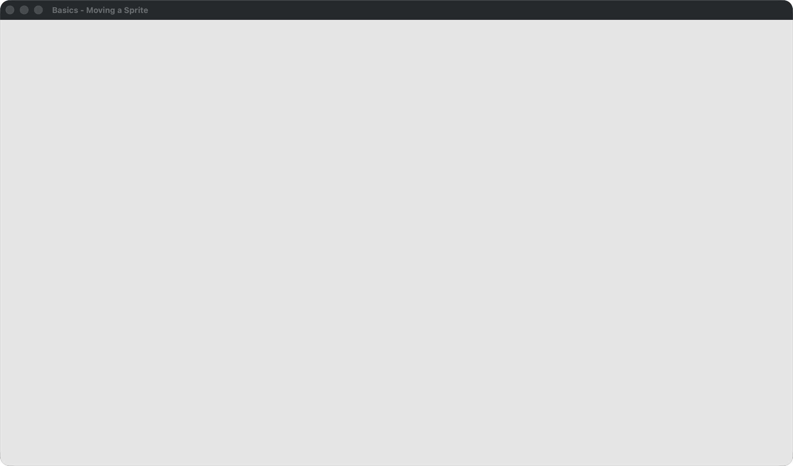
    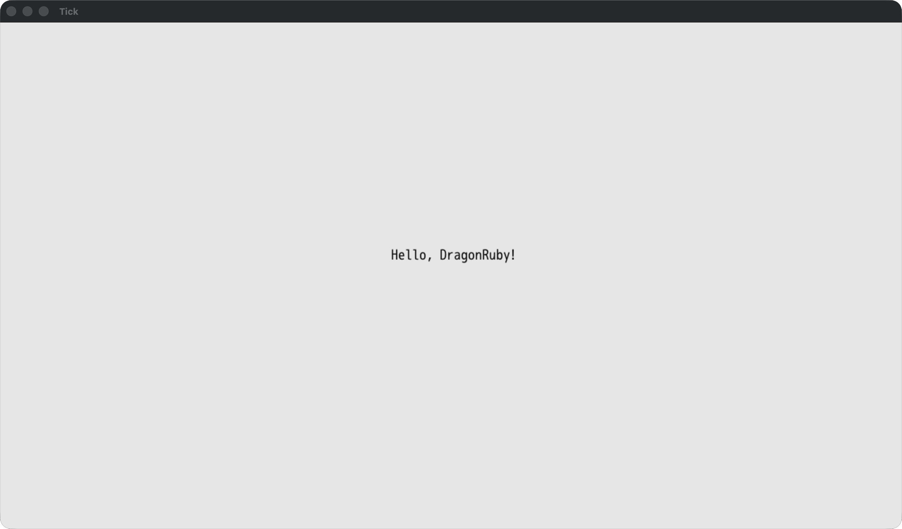
    <SlidevVideo v-after autoplay loop muted class="absolute inset-0 w-full h-full object-contain">
      <source :src="'/videos/tick-counter.mp4'" type="video/mp4" />
    </SlidevVideo>
  </div>
  <div class="relative w-full text-center text-sm mt-3" style="color: var(--color-muted)">
    <div v-click.hide="1">Empty window — tick runs every frame</div>
    <div v-click="[1, 2]" class="absolute inset-0">A label drawn on screen</div>
    <div v-after class="absolute inset-0">Frame and second counters tick up</div>
  </div>
</div>

---
layout: two-cols-header
---

## Movement

::left::

<FileName>main.rb</FileName>

````md magic-move
```ruby
def tick(args)
  args.state.player ||= {
    x: 100, y: 100,
    w: 50, h: 50,
    path: 'sprites/square/green.png'
  }
end
```
```ruby {8}
def tick(args)
  args.state.player ||= {
    x: 100, y: 100,
    w: 50, h: 50,
    path: 'sprites/square/green.png'
  }

  args.outputs.sprites << args.state.player
end
```
```ruby {8-19}
def tick(args)
  args.state.player ||= {
    x: 100, y: 100,
    w: 50, h: 50,
    path: 'sprites/square/green.png'
  }

  if args.inputs.up
    args.state.player.y += 10
  elsif args.inputs.down
    args.state.player.y -= 10
  end

  if args.inputs.left
    args.state.player.x -= 10
  elsif args.inputs.right
    args.state.player.x += 10
  end

  args.outputs.sprites << args.state.player
end
```
````

::right::

<div class="flex flex-col items-center justify-center h-full">
  <div class="relative w-full aspect-video">
    
    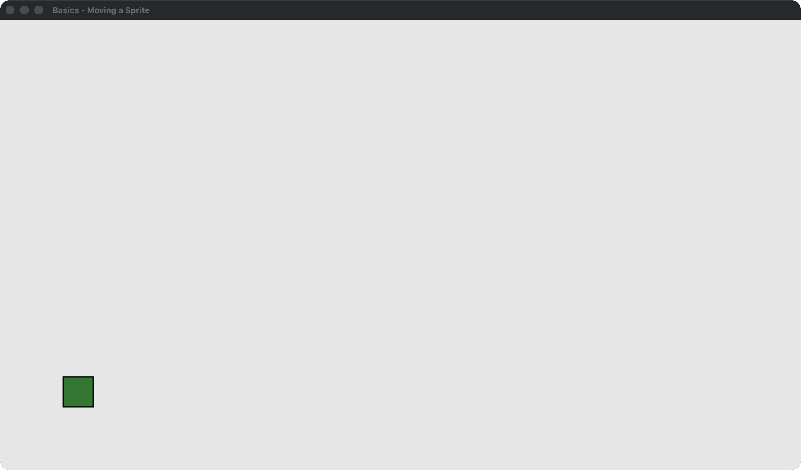
    <SlidevVideo v-after autoplay loop muted class="absolute inset-0 w-full h-full object-contain">
      <source :src="'/videos/sprite-moving.mp4'" type="video/mp4" />
    </SlidevVideo>
  </div>
  <div class="relative w-full text-center text-sm mt-3" style="color: var(--color-muted)">
    <div v-click.hide="1">Player defined — nothing drawn yet</div>
    <div v-click="[1, 2]" class="absolute inset-0">Player drawn as a green square</div>
    <div v-after class="absolute inset-0">Arrow keys move the square</div>
  </div>
</div>

---
layout: two-cols-header
---

## Collisions

::left::

<FileName>main.rb</FileName>

````md magic-move
```ruby
def tick(args)
  args.state.terrain ||= [...]
  args.outputs.sprites << args.state.terrain

  args.state.player ||= {...}
  args.outputs.sprites << args.state.player
end
```
```ruby {8-9}
def tick(args)
  args.state.terrain ||= [...]
  args.outputs.sprites << args.state.terrain

  args.state.player ||= {...}
  args.outputs.sprites << args.state.player

  args.state.player.dx = args.inputs.left_right * 2
  args.state.player.x += args.state.player.dx
end
```
```ruby {11-17}
def tick(args)
  args.state.terrain ||= [...]
  args.outputs.sprites << args.state.terrain

  args.state.player ||= {...}
  args.outputs.sprites << args.state.player

  args.state.player.dx = args.inputs.left_right * 2
  args.state.player.x += args.state.player.dx

  collision = args.state.terrain.find do |t|
    t.intersect_rect?(args.state.player)
  end
  
  if collision
    args.state.player.x -= args.state.player.dx
  end
end
```
````

::right::

<div class="flex flex-col items-center justify-center h-full">
  <div class="relative w-full aspect-video">
    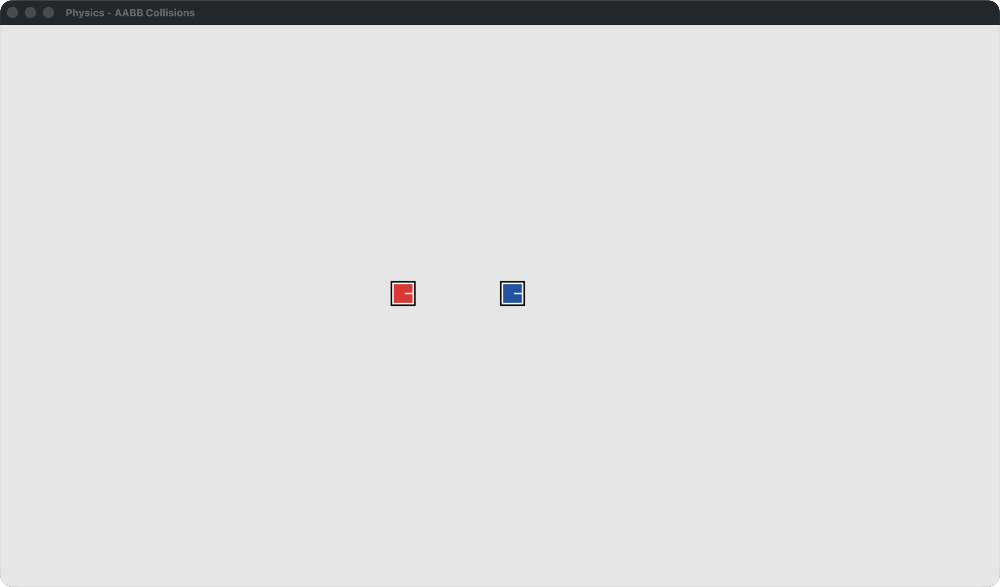
    <SlidevVideo v-click="[1, 2]" autoplay loop muted class="absolute inset-0 w-full h-full object-contain">
      <source :src="'/videos/collision.mp4'" type="video/mp4" />
    </SlidevVideo>
    <SlidevVideo v-after autoplay loop muted class="absolute inset-0 w-full h-full object-contain">
      <source :src="'/videos/collision-resolved.mp4'" type="video/mp4" />
    </SlidevVideo>
  </div>
  <div class="relative w-full text-center text-sm mt-3" style="color: var(--color-muted)">
    <div v-click.hide="1">Red player and blue terrain, apart</div>
    <div v-click="[1, 2]" class="absolute inset-0">Player moves right, through the terrain</div>
    <div v-after class="absolute inset-0">Collision detected — player stops at the edge</div>
  </div>
</div>

---
dragPos:
  c: 161,273,117,123
  sdl: 376,155,210,106
  ruby: 756,158,118,118
  rubyFile: 734,274,175,44
  weWrite: 630,39,180,40
  cFile: 446,424,175,44
  native: 70,125,657,365
  dragonruby: 90,140,100,79
  cSource: 133,397,175,44
  cCompiled: 475,301,117,123
---

## 👋 Architecture 👋

<div v-click="4" v-drag="'native'" class="border-3 border-dashed border-gray-400 rounded"></div>


<div v-click="3" v-drag="'cSource'" class="flex justify-center">

```
dragonruby.c
```

</div>


<div v-click="1" v-drag="'rubyFile'" class="flex justify-center">

```
main.rb
```

</div>


<div v-click="2" v-drag="'cFile'" class="flex justify-center">

```
main.c
```

</div>

<FancyArrow v-click="3" two-way from="[data-id=c]" to="[data-id=sdl]" />

<FancyArrow v-click="3" two-way from="[data-id=c]" to="[data-id=c-compiled]">
  <code class="px-2 py-1 rounded bg-white">tick(args)</code>
</FancyArrow>

<FancyArrow v-click="2" from="[data-id=ruby]" to="[data-id=c-compiled]">
  <code class="px-2 py-1 rounded bg-white">mrbc -B</code>
</FancyArrow>

<div v-click="1" v-drag="'weWrite'" data-id="we-write" class="font-bold text-center">We write this file</div>

<FancyArrow v-click="1" from="[data-id=we-write]" to="[data-id=ruby]" />

<!--
https://mruby.org/docs/articles/executing-ruby-code-with-mruby.html
-->

---
layout: section
hideInToc: false
---

# Building the game

---
---

## Page Structure

<Framed src="/images/page-structure.png" alt="AuthHell page structure: game canvas, video playlist sidebar, and the Enemy Encounter 2FA re-auth toast" />

<div v-drag="[60,220,150,44,-6]" data-id="dragonruby-label" class="ah-card bg-white px-3 py-1.5 font-bold -rotate-2 grid place-items-center">DragonRuby</div>
<FancyArrow color="red-500" width="3" from="[data-id=dragonruby-label]@right" to="(280, 205)" />

<div v-drag="[820,430,110,44,7]" data-id="rails-label" class="ah-card bg-white px-3 py-1.5 font-bold rotate-2 grid place-items-center">Rails</div>
<FancyArrow color="red-500" width="3" from="[data-id=rails-label]@left" to="(700, 420)" />

---
layout: two-cols
dragPos:
  wasmLogo: 642,243,261,261
  wasmDragonruby: 121,257,300,237
---

## WebAssembly (WASM)

::left::

- Binary instruction format for the web
- Run any language in the browser
- Including DragonRuby!


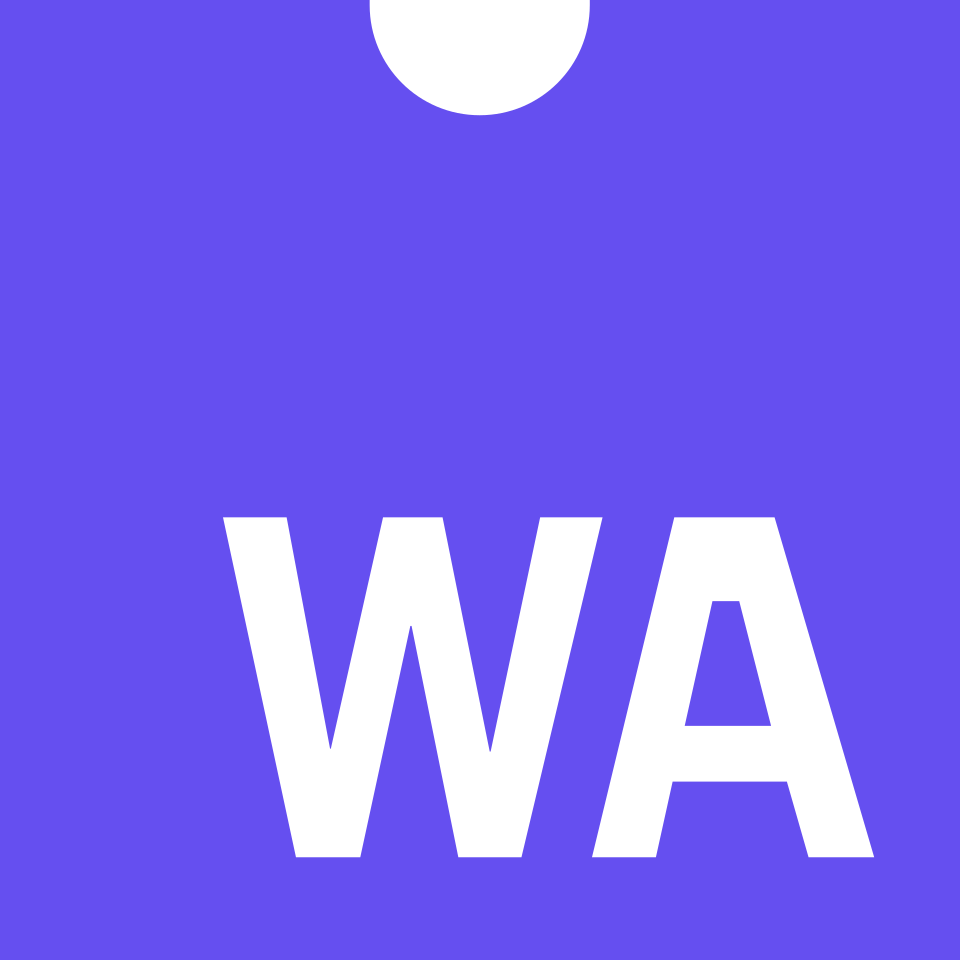

<FancyArrow from="[data-id=wasm-dragonruby]" to="[data-id=wasm-logo]">
</FancyArrow>

<!--
DragonRuby compiles our game to WebAssembly, which is how it runs in the
browser at native-ish speed — that's the artifact Rails serves at /game.
-->

---

## Why Rails?

- DragonRuby can be stand-alone
- Rails allows for authentication methods players are used to


---

## Proof of concept

<div class="flex justify-center mt-6">
  <div class="ah-card bg-white p-2 leading-none">
    <SlidevVideo autoplay loop muted class="block max-h-[380px] w-auto">
      <source :src="'/videos/proof-of-concept.mp4'" type="video/mp4" />
    </SlidevVideo>
  </div>
</div>

---
---

## Discord to the rescue

<Framed>
  <div class="ah-card bg-white p-2 leading-none">
    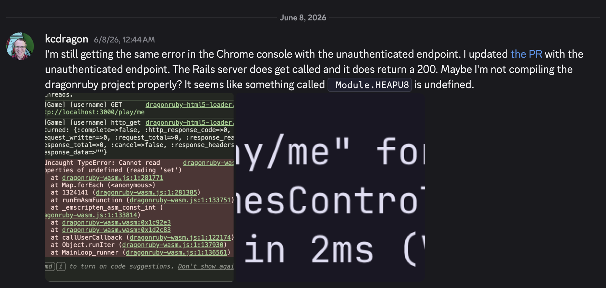
  </div>
  <div class="ah-card bg-white p-2 leading-none">
    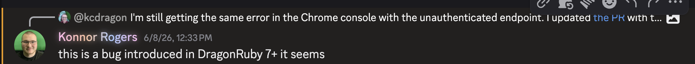
  </div>
</Framed>

---
---

## Claude Design

<Framed src="./images/claude-design.png" alt="Claude Design canvas redesigning the game screens" />

---
---

## Claude Code

<Framed src="./images/claude-code.png" imgClass="block max-h-[400px] w-auto" alt="Claude Code proposing a plan for a space-bar jump in the /play game, with context, approach, and jump physics constants" />

---
---

## Authenticate in game

<div class="flex justify-center mt-6">
  <div class="ah-card bg-white p-2 leading-none">
    <SlidevVideo autoplay loop muted class="block max-h-[380px] w-auto">
      <source :src="'/videos/authenticate-in-game.mp4'" type="video/mp4" />
    </SlidevVideo>
  </div>
</div>

---
layout: two-cols-header
---

## Player hit by TOTP enemy

::left::

<FileName>main.rb</FileName>

````md magic-move
```ruby {4-8}
def tick(args)
  ...
  
  if collision?(args)
    args.state.collision_request = DR.http_post(
      "/games/totp/start"
    )
  end
end
```
```ruby {10-13}
def tick(args)
  ...
  
  if collision?(args)
    args.state.collision_request = DR.http_post(
      "/games/totp/start"
    )
  end
  
  if args.state.collision_request[:complete]
    args.state.collision_request = nil
    args.state.player.frozen = true
  end
end
```
````

::right::

<div class="flex items-center justify-center h-full">
  <div class="ah-card bg-white p-2 leading-none">
    <SlidevVideo autoplay loop muted class="block w-full h-auto">
      <source :src="'/videos/trigger-auth-game.mp4'" type="video/mp4" />
    </SlidevVideo>
  </div>
</div>

---
layout: two-cols-header
---

## Present TOTP challenge toast

::left::

<FileName>totp_challenge_controller.rb</FileName>

````md magic-move
```ruby {3}
class Games::TotpChallengeController < ApplicationController
  def start
    Current.session.start_totp_game_challenge!
  end
end
```
```ruby {5-10}
class Games::TotpChallengeController < ApplicationController
  def start
    Current.session.start_totp_game_challenge!

    Turbo::StreamsChannel.broadcast_append_to(
      Current.user, :toasts,
      target: "toasts_container",
      partial: "games/totp_challenge",
      locals: { user: Current.user }
    )

    head :no_content
  end
end
```
````

::right::

<div class="flex items-center justify-center h-full">
  <div class="ah-card bg-white p-2 leading-none">
    <SlidevVideo autoplay loop muted class="block w-full h-auto">
      <source :src="'/videos/totp-toast.mp4'" type="video/mp4" />
    </SlidevVideo>
  </div>
</div>

---
layout: two-cols-header
---

## Authenticate in toast

::left::

<FileName>totp_challenge_controller.rb</FileName>

````md magic-move
```ruby {3-6}
class Games::TotpChallengeController < ApplicationController
  def complete
    if Current.user.verify_totp(params[:code])
      Current.session.complete_totp_game_challenge!
      render turbo_stream: turbo_stream.remove(toast_id)
    end
  end
  
  def toast_id = dom_id(current_user, :totp_challenge)
end
```
```ruby {6-11}
class Games::TotpChallengeController < ApplicationController
  def complete
    if Current.user.verify_totp(params[:code])
      Current.session.complete_totp_game_challenge!
      render turbo_stream: turbo_stream.remove(toast_id)
    else
      render turbo_stream: turbo_stream.replace(
        toast_id,
        partial: "games/totp_challenge",
        locals: { error: "Invalid password. Try again." }
      )
    end
  end
  
  def toast_id = dom_id(current_user, :totp_challenge)
end
```
````

::right::

<div class="flex items-center justify-center h-full">
  <div class="ah-card bg-white p-2 leading-none">
    <SlidevVideo autoplay loop muted class="block w-full h-auto">
      <source :src="'/videos/complete-totp-toast.mp4'" type="video/mp4" />
    </SlidevVideo>
  </div>
</div>

---
layout: two-cols-header
---

## Unfreeze player

::left::

<FileName>main.rb</FileName>

````md magic-move
```ruby {4-8}
def tick(args)
  ...
  
  if args.state.player.frozen
    if !args.state.status_request
      args.state.status_request = DR.http_get("/games/totp/status")
    end
  end
end
```
```ruby {7-13}
def tick(args)
  ...
  
  if args.state.player.frozen
    if !args.state.status_request
      args.state.status_request = DR.http_get("/games/totp/status")
    elsif args.state.status_request[:complete]
      data = DR.parse_json(args.state.status_request[:response_data])
      if data && data["frozen"] == false
        args.state.player.frozen = false
      end
      args.state.status_request = nil
    end
  end
end
```
````

::right::

<div class="flex items-center justify-center h-full">
  <div class="ah-card bg-white p-2 leading-none">
    <SlidevVideo autoplay loop muted class="block w-full h-auto">
      <source :src="'/videos/unfreeze-totp-challenge.mp4'" type="video/mp4" />
    </SlidevVideo>
  </div>
</div>

---
layout: two-cols-header
---

## Check challenge status

::left::

<FileName>totp_challenge_controller.rb</FileName>

````md magic-move
```ruby
class Games::TotpChallengeController < ApplicationController
  def status
    render json: { frozen: !completed? }
  end
  
  private
  
  def completed? = Current.session.totp_game_challenge_completed?
end
```
````

::right::

<div class="flex items-center justify-center h-full">
  <div class="ah-card bg-white p-2 leading-none">
    <SlidevVideo autoplay loop muted class="block w-full h-auto">
      <source :src="'/videos/unfreeze-totp-challenge.mp4'" type="video/mp4" />
    </SlidevVideo>
  </div>
</div>

---
layout: two-cols-header
---

## Time-based One Time Passwords

::left::

<FileName>Gemfile</FileName>

```ruby
gem "rotp"    # One Time Passwords
gem "rqrcode" # QR Codes
```

::right::

<div class="flex flex-col items-center gap-3">
  <div class="ah-card bg-white p-2 leading-none">
    
  </div>
  <div class="ah-card bg-white p-2 leading-none">
    
  </div>
</div>

---
layout: two-cols-header
---

## Passkeys

::left::

<FileName>Gemfile</FileName>

```ruby
gem "webauthn"
```

::right::

<div class="flex flex-col items-center gap-3">
  <div class="ah-card bg-white p-2 leading-none">
    
  </div>
  <div class="ah-card bg-white p-2 leading-none">
    
  </div>
</div>


---

## Takeaways

- You can develop your own game... in Ruby!
- You can easily add better authentication methods, like Passkeys, to your app

---
layout: cover
---

# Questions or feedback?

<div class="flex items-start justify-center gap-16 mt-10">
  <div class="flex flex-col items-center">
    <a href="https://authenticationhell.com" target="_blank" rel="noopener" class="ah-tagline !mt-0 mb-3 text-xl !text-ink no-underline">authenticationhell.com</a>
    <div class="ah-card bg-white p-4 leading-none">
      
    </div>
  </div>
  <div class="flex flex-col items-center">
    <a href="https://github.com/kcdragon/authentication-hell" target="_blank" rel="noopener" class="ah-tagline !mt-0 mb-3 text-xl !text-ink no-underline flex items-center gap-2">
      <ph-github-logo-fill class="text-2xl" /><span class="text-sm">kcdragon/authentication-hell</span>
    </a>
    <div class="ah-card bg-white p-4 leading-none">
      
    </div>
  </div>
  <div class="flex flex-col items-center">
    <a href="https://mikedalton.co/socials/" target="_blank" rel="noopener" class="ah-tagline !mt-0 mb-3 text-xl !text-ink no-underline">mikedalton.co/socials</a>
    <div class="ah-card bg-white p-4 leading-none">
      
    </div>
  </div>
</div>

<div class="absolute bottom-4 left-0 right-0 text-center text-xs text-muted">
  Built with
  <a href="https://www.ruby-lang.org/en/" target="_blank" rel="noopener">Ruby</a>
  ·
  <a href="https://rubyonrails.org/" target="_blank" rel="noopener">Ruby on Rails</a>
  ·
  <a href="https://dragonruby.org/" target="_blank" rel="noopener">DragonRuby</a>
  ·
  <a href="https://sli.dev/" target="_blank" rel="noopener">Slidev</a>
</div>
